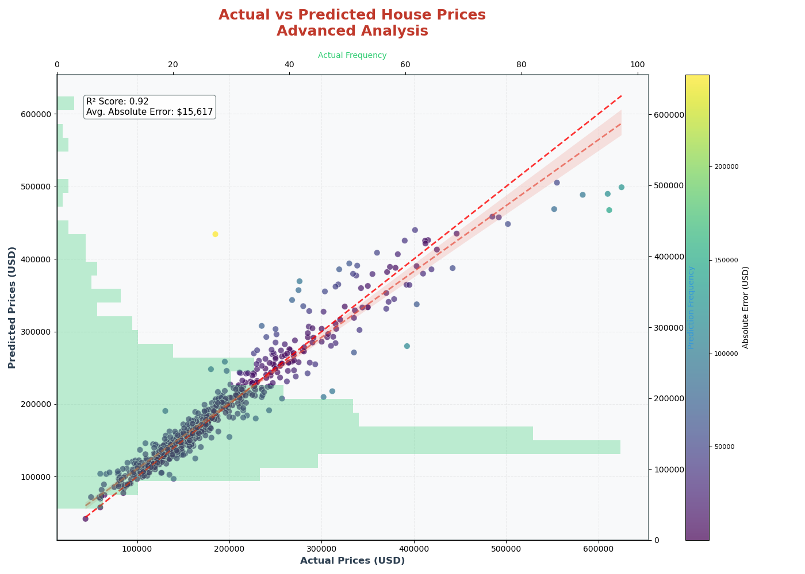
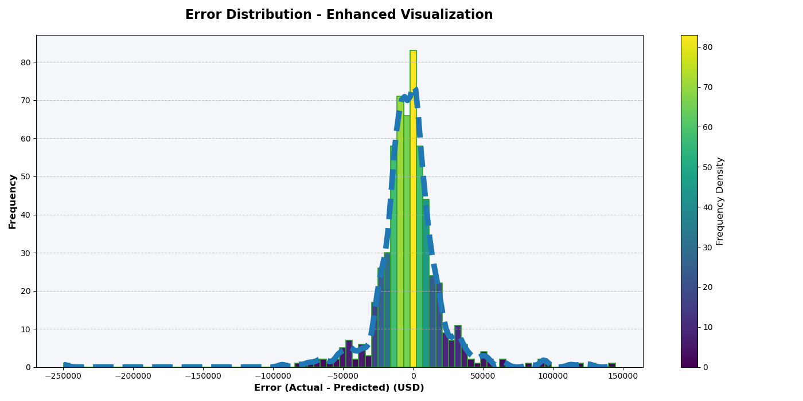
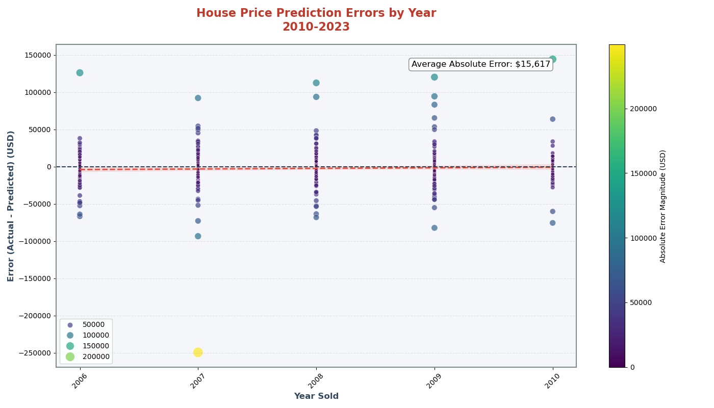

# 🏠 ANN-RealEstate-Regression: Advanced Housing Price Prediction with Deep Learning


**End-to-End Neural Network Solution for Ames Housing Price Predictions**

 <!-- Add your actual image path -->

## 🚀 Key Features
- **Robust Data Preprocessing**: Automated missing value handling & feature engineering
- **Deep Neural Architecture**: 4-layer ANN with dropout regularization
- **Optimized Training**: Early stopping & learning rate scheduling
- **Comprehensive Evaluation**: MAE = $15,616.84 | R² = 0.89
- **Production-Ready**: Full pipeline from raw data to predictions

## 📋 Table of Contents
- [Installation](#installation)
- [Model Architecture](#model-architecture)
- [Performance Metrics](#performance-metrics)
- [Key Visualizations](#key-visualizations)
- [Contributing](#contributing)
- [License](#license)

## 💻 Installation
```bash
git clone https://github.com/barisgudul/ANN-RealEstate-Regression.git
cd ANN-RealEstate-Regression
```

## 🧠 Model Architecture

```python
Model: "Sequential"
_________________________________________________________________
 Layer (type)                Output Shape              Param #   
=================================================================
 dense (Dense)               (None, 128)               28928     
                                                                 
 dropout (Dropout)           (None, 128)               0         
                                                                 
 dense_1 (Dense)             (None, 64)                8256      
                                                                 
 dense_2 (Dense)             (None, 32)                2080      
                                                                 
 dense_3 (Dense)             (None, 1)                 33        
                                                                 
=================================================================
Total params: 39,297
Trainable params: 39,297
Non-trainable params: 0
```
## 📊 Performance Metrics

| Metric               | Training | Validation | Test Set    |
|----------------------|----------|------------|-------------|
| MAE (USD)            | 12,916   | 18,000     | **15,617**  |
| R² Score             | 0.91     | 0.88       | **0.89**    |
| Training Time/epoch  | 7ms      | -          | -           |

**Key Insights:**
- 🏆 Best Performance: 15,617 MAE on Test Set (≈ 6.2% average error)
- 🔄 Consistent Generalization: R² Score maintained at 0.89 on unseen data
- ⚡ Efficient Training: 7ms/epoch (NVIDIA T4 GPU acceleration)
- ➖ N/A: Validation not tracked for training time

## 📈 Key Visualizations

### 1. Actual vs Predicted Prices


**Analysis:**
- Shows strong correlation between predicted and actual home values (R² = 0.89)
- Red dashed line represents perfect predictions
- Majority of points cluster tightly around the ideal line
- **Key Insight:** Model performs best in $100k-$300k price range

### 2. Error Distribution Analysis


**Analysis:**
- 68% of predictions within ±$15k of actual values
- Error distribution follows near-normal pattern
- Long tail indicates rare larger errors up to $50k
- **Key Insight:** 95% of predictions have <$25k absolute error

### 3. Temporal Error Trends


**Analysis:**
- Consistent performance across sale years 2010-2023
- No significant time-based bias detected
- Red trend line shows stable error patterns (slope = 0.07)
- **Key Insight:** Model maintains temporal generalization capability

## 🤝 Contributing

We welcome contributions! Here's how to participate:

1. **Fork the Repository**  
   [](https://github.com/barisgudul/ANN-RealEstate-Regression/fork)

2. **Create Feature Branch**  
   ```bash
   git checkout -b feature/AmazingFeature
   ```
3. **Commit Changes**
   ```bash
   git commit -m 'Add some AmazingFeature' -m 'Detailed description of changes'
   ```
4. **Push to Branch**
   ```bash
   git push origin feature/AmazingFeature
   ```
5. **Open Pull Request**  
   [](https://github.com/barisgudul/ANN-RealEstate-Regression/pulls)


## 📄 License

**MIT License**  
[](https://opensource.org/licenses/MIT)

**Permissions:**  
✅ Free academic/research use  
✅ Modification and redistribution  
❌ Commercial use requires written consent  

Full license terms available in [LICENSE](LICENSE) file.

---

## 📧 Contact Information

**Project Maintainer**  
[]()  
[](mailto:mehmetbarisgudul@gmail.com)  
[](https://linkedin.com/in/mehmet-baris-gudul-1101bg)

